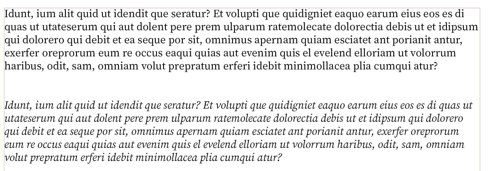
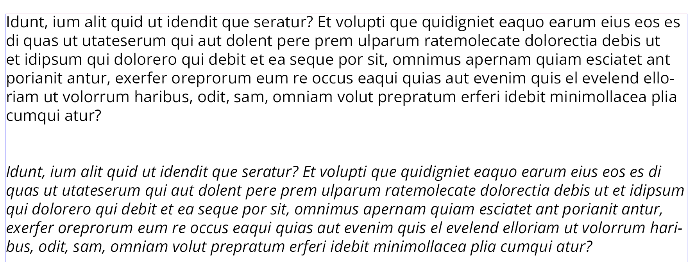
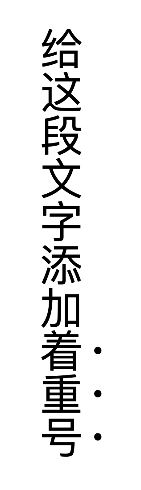
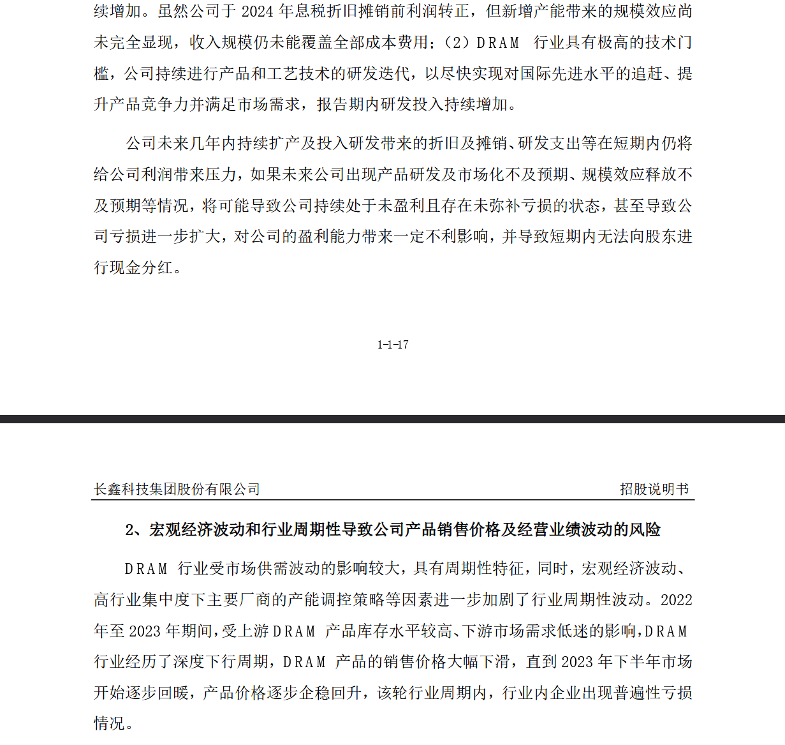
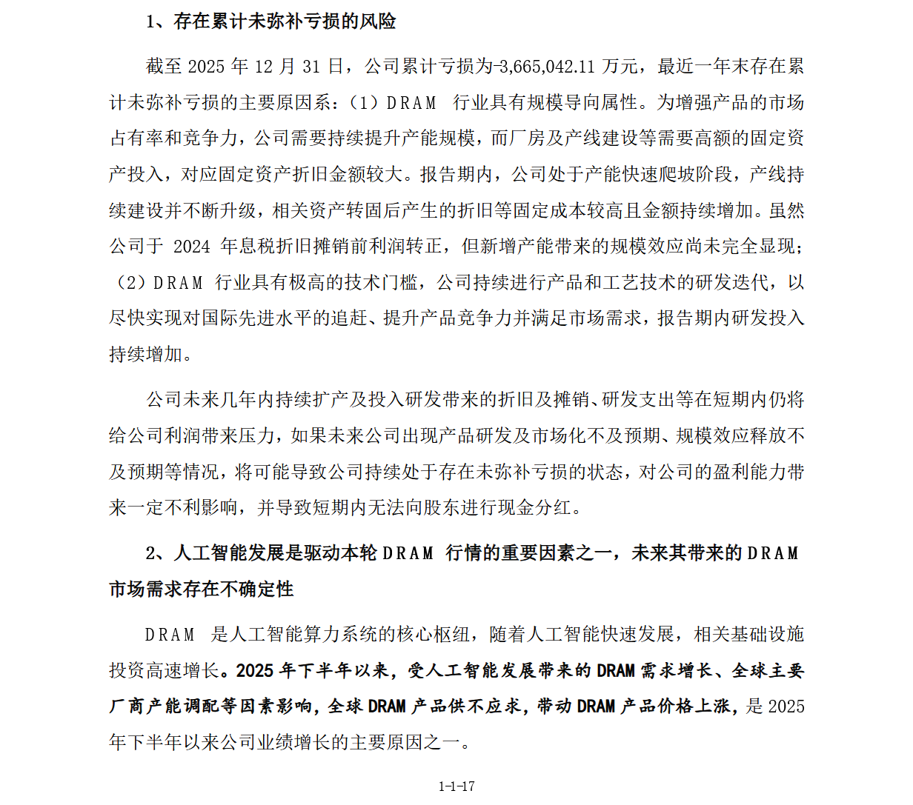

+++
title = "东亚文字绝对没有斜体"
date = 2026-04-27
categories = ["字体排印"]
tags = ["中文", "Web排版", "桌面出版"]

+++

东亚文字没有斜体。

西文的*Italic*比较准确的叫法是「意大利手写体」而非单纯的「斜体」，它是斜的是因为它在模仿手写的字形，手写是斜的字形所以*Italic*是斜的。比较好的西文字体会为斜体（*Italic*）设计一套专门的、外观更偏向手写的字形。

比如说，下图展示了*Source Serif 4*字体的正体和斜体形式：

而无衬线体优先照顾屏幕显示，为保证易读性，不会为斜体字形增加太多的「手写感」，但仍然是有区别的。下图是*Open Sans*字体的正体和斜体形式，可明显看出正体的「a」字母为双层a，而斜体为单层*a*，斜体的「*f*」字母有小尾巴而正体没有。

中文无论印刷还是手写都是端端正正的，不存在斜的写法。某些软件可以为这些本不该有斜体的文字强行加斜体，做法其实是简单地把正体推斜，这被称为*oblique*（伪斜体），是非常丑陋且绝对应该禁止的。

西文中常用斜体表示强调，而中文表示强调应当用**加粗**或着重号（即在横排文本的下侧、直排文本的右侧放圆点，具体效果见下图）。

这时你可能会好奇，西文中会把斜体用在成段的引文处以示与正文的不同，中文碰到类似场景要怎么办呢？

对于内地地区正文以宋体为主的情况，答案是可以用**楷体**以示区别。中文排版中比较接近原教旨西文*Italic*的概念其实是楷体，两者都在模仿手写字形。

> **[W3C中文排版需求3.1.1.2条：楷体](https://www.w3.org/TR/clreq/#kai)**
>
> 楷体也可与其他字体搭配，用于标题、引言、摘句、对话、内容出处等与内文有所不同的段落上。

某些正式文档中也会使用**楷体加粗**表示对原文的修订或补充。例如，2026年5月[长鑫科技集团股份有限公司科创板首次公开发行股票招股说明书（注册稿）](https://static.sse.com.cn/stock/disclosure/announcement/c/202605/002170_20260527_23QQ.pdf)中就使用上述方式补充了2025年12月[长鑫科技集团股份有限公司科创板首次公开发行股票招股说明书（申报稿）](https://static.sse.com.cn/stock/disclosure/announcement/c/202512/002170_20251230_B8QS.pdf)披露后新增或发生变化的信息：

---

最后还有一种情况是，某些西文文学作品——尤其是带有特殊设定的科幻或奇幻小说——会使用斜体来表示一些超出传统标点符号（如引号）用法的情况，这类作品被翻译为中文时，译者和编辑同样会用楷体来替代原文中的斜体。